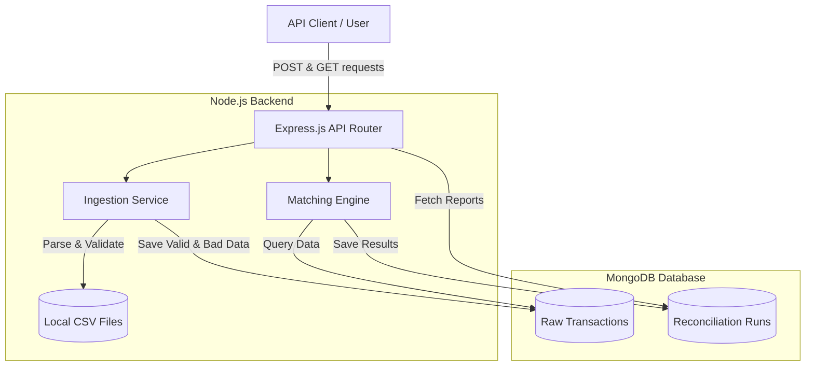
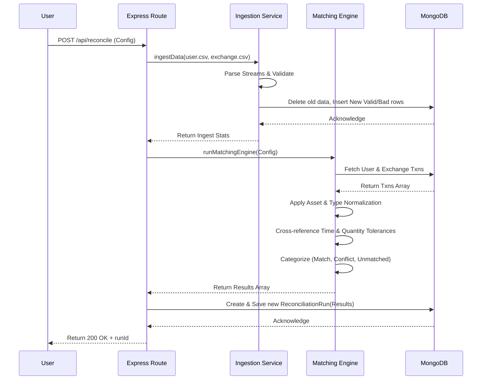
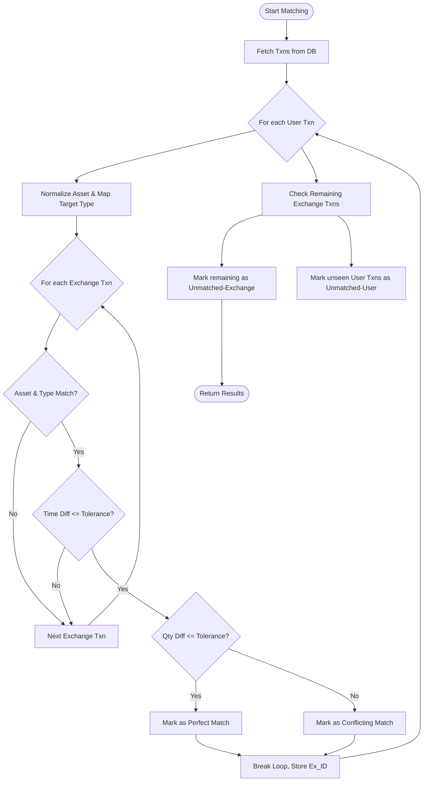
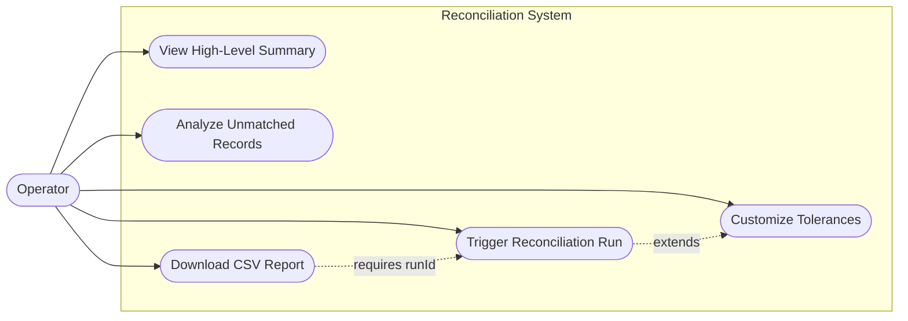

# Transaction Reconciliation Engine

An automated, Node.js-based reconciliation engine designed to ingest, normalize, and match cryptocurrency transactions from two distinct sources (User and Exchange). It intelligently handles data quality issues, maps opposing transaction types, and applies configurable time and quantity tolerances to pair records and identify discrepancies.

## 🛠 Tech Stack

| Component | Technology | Purpose |
| :--- | :--- | :--- |
| **Runtime** | Node.js | Core execution environment for the backend application. |
| **Framework** | Express.js | Lightweight web framework for exposing REST API endpoints. |
| **Database** | MongoDB | NoSQL database for flexible schema storage of raw and matched data. |
| **ODM** | Mongoose | Object Data Modeling library for MongoDB interactions. |
| **Utilities** | `csv-parser`, `csv-writer` | Efficient stream-based parsing and writing of CSV reports. |
| **Environment** | `dotenv` | Management of configurable environment variables. |

---

## 📸 Media & Demos

### Demo Video
*(Add your demo video here)*
> ``

### Application Screenshots
*(Add your screenshots here)*
> ``
> ``

---

## 🚀 Setup & Installation

### Prerequisites
- **Node.js** (v14 or higher)
- **MongoDB** (Running locally on default port 27017, or a remote URI)

### Steps

1. **Clone & Navigate**
   Ensure you are in the project root directory containing the source files and the two CSV data files (`user_transactions.csv` and `exchange_transactions.csv`).

2. **Install Dependencies**
   ```bash
   npm install
   ```

3. **Configure Environment**
   Create or verify the `.env` file in the root directory:
   ```env
   PORT=3000
   MONGODB_URI=mongodb://localhost:27017/reconciliation
   TIMESTAMP_TOLERANCE_SECONDS=300
   QUANTITY_TOLERANCE_PCT=0.01
   ```

4. **Start the Server**
   ```bash
   node index.js
   # or 'npm start' / 'npx nodemon index.js' for development
   ```
   *You should see "Connected to MongoDB" and "Reconciliation engine is running on port 3000".*

---

## 🧠 Key Decisions & Assumptions

During development, several key design decisions were made to address unclear or ambiguous requirements:

1. **Data Ingestion Flow**: Instead of building a complex file-upload API, the system is designed to directly ingest `user_transactions.csv` and `exchange_transactions.csv` from the root directory when the `/reconcile` endpoint is triggered. This streamlines testing while accurately reflecting batch-processing architectures.
2. **Database Persistence Strategy**: To prevent database bloat during repeated testing, the raw `Transaction` and `BadRecord` collections are cleared at the start of every new reconciliation run. However, the historical results of the runs themselves are permanently saved in the `ReconciliationRun` collection.
3. **Tolerance Interpretation**: The requirement "Quantity: ± configurable tolerance (e.g. 0.01% by default)" was interpreted as a percentage rather than a flat absolute value. A config value of `0.01` is treated mathematically as `0.01%`.
4. **Asset & Type Mapping**: 
   - **Assets**: Hardcoded a normalization dictionary (e.g., `bitcoin` -> `BTC`, `ethereum` -> `ETH`) to handle case-insensitive aliases. In a production system, this would be moved to a dynamic database table.
   - **Types**: Implemented relational mapping for transfers. A User `TRANSFER_OUT` is actively matched against an Exchange `TRANSFER_IN` (and vice-versa), recognizing they are two sides of the same blockchain event.
5. **CSV Reporting**: The requirement requested "Produce a report (again in CSV format)". Rather than writing a file to disk that the user has to find, the REST API returns standard JSON by default, but allows the user to append `?format=csv` to the endpoint URL to dynamically download the report as a parsed CSV file.

---

## 🌐 API Endpoints

### 1. Trigger Reconciliation
**`POST /api/reconcile`**
Initiates the parsing, validation, and matching engine.
- **Body (Optional):** Overrides for tolerances.
  ```json
  {
    "TIMESTAMP_TOLERANCE_SECONDS": 600,
    "QUANTITY_TOLERANCE_PCT": 0.05
  }
  ```
- **Response:** Returns ingestion stats and a `runId` required for subsequent report queries.

### 2. Fetch Full Report
**`GET /api/report/:runId`**
Fetches the complete array of categorized transactions (Matched, Conflicting, Unmatched).
- **Query Params:** `?format=csv` (Downloads the response as a formatted `.csv` file).

### 3. Fetch Summary
**`GET /api/report/:runId/summary`**
Returns high-level analytical counts of the run.
- **Response:**
  ```json
  {
    "matched": 21,
    "conflicting": 1,
    "unmatched_user": 1,
    "unmatched_exchange": 3
  }
  ```

### 4. Fetch Unmatched Records
**`GET /api/report/:runId/unmatched`**
Filters the detailed report to return *only* the transactions that failed to find a pair, providing the reason for failure.

---

## 📊 System Diagrams

### 1. Architectural Diagram
Visualizing the high-level system components and data flow.



### 2. Sequential Diagram
The step-by-step execution flow when a reconciliation is triggered.



### 3. Workflow Diagram
The internal logic tree of the Matching Engine.



### 4. Use Case Diagram
High-level interactions available to the system operator.


